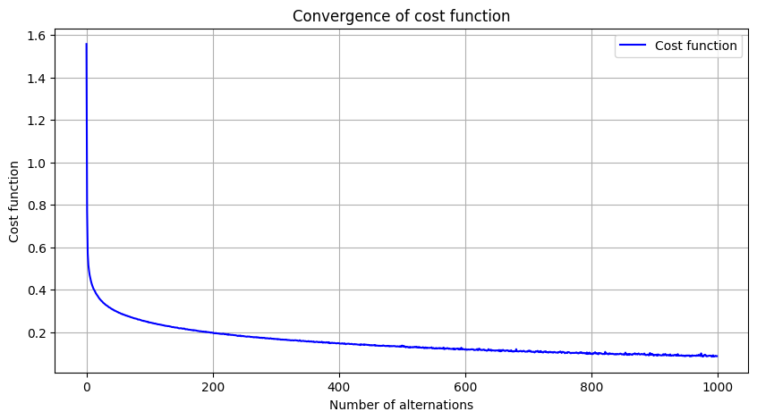
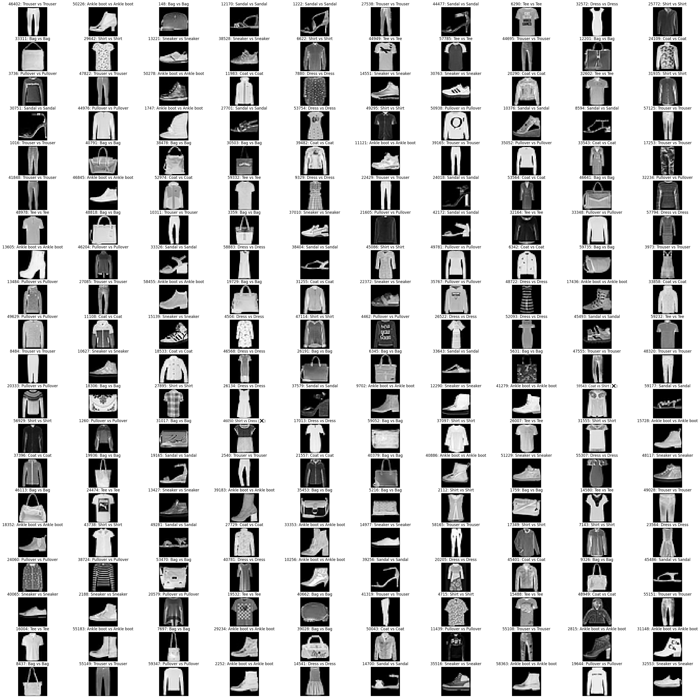

# ***Multi-layer Perceptron using Numpy***

## **Overview**
- This network is based of the classic Multi-layer Perceptron network, that mimics the learning of a human neuron. Everything of the model, except for importing dataset, is done in Numpy with a bit of Algebra in mind.
- The math is learnt via this [Machine Learning book](https://github.com/tiepvupsu/ebookMLCB).
- The model learns fairly well, 97.5% after 1000 epochs. This network uses mini-batch Stochastic Gradient Descent to optimize weights.

## **Model details**

**Features**
1. **Rectified Linear Unit** (ReLU) activation function
2. **Mini-batch Gradient Descent**
3. **Cross-entropy loss**

**Dataset**
- Fashion MNIST, imported from `torchvision.datasets`

## **Training**
**Setup**
- Python: **3.11**
- NumPy: **2.1.2**
- CPU: **Intel i5**

**Hyperparameters**
- Epochs: **1000**
- Learning rate: **0.01**
- Optimizer: **SGD** 
- Customizable hidden neurons size: d1 = 30, d2 = 15, d3 = 10

**Result** of ***Image Classification***
- Training Accuracy = 97.5 % (Fashion MNIST)
- Evaluation Accuracy = 85.1%  
=> The model showed signs of OVERFITTING, this can be resolved by applying Dropout and Regularizations.

**Visualization**
*Metrics plotting*

    
  <em> Convergence of loss </em>

*Classified outputs on CIFAR-10*

    
  <em> Classified predictions </em>

## **References**

* Machine Learning online book by Vu Huu Tiep: https://machinelearningcoban.com/2017/02/24/mlp/